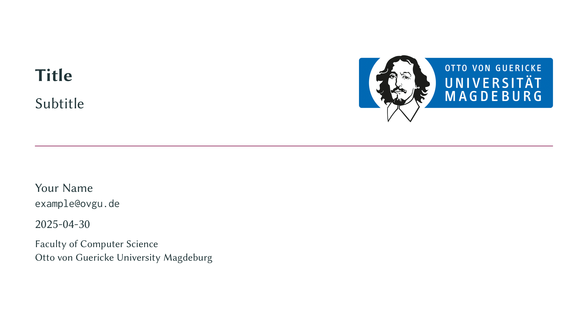

# The `ams-slides` Polylux Template

<p align="center">
    
    <br/>
    
    
</p>

<p align="center">
A simple <a href="https://typst.app/universe/package/polylux/">polylux</a> slides template based on the AMS working group at Otto-von-Guericke University Magdeburg.
</p>

## Getting Started

To use this template, simply import it as shown below and define a `title-slide` with the following possible options:

```typ
#import "@preview/ams-slides:0.1.0": * // Once public to typst-packages
#import "@local/ams-slides:0.1.0": * // If installed locally

#show: ams-theme

#title-slide(
  /// The title of your presentation.
  /// -> content | none
  title: none,
  /// The author data (name and mail).
  /// -> dictionary
  author: (name: "Your name", mail: "example@ovgu.de"),
  /// An optional subtitle.
  /// -> content | none
  subtitle: none,
  /// An optional shorter title for the footer.
  /// -> content | none
  short-title: none,
  /// The current date and formatting (default: `datetime.today()`).
  /// -> datetime
  date: datetime.today().display("[day].[month].[year]"),
  /// Extra data such as course title, institute or university.
  /// -> content | none
  extra: none,
  /// The university logo in the top left of the title slide.
  /// -> content
  university-logo: university-logo,
  /// The backdrop logo in the top right of the title slide.
  /// -> content
  backdrop-logo: backdrop-logo,
  /// The insititute logos as an array in the bottom right of the title slide.
  /// -> array
  institute-logos: (kmd-logo, ams-logo),
)
```

These are **all** the default options. We recommend leaving the show-rule as-is, such that you can just do `#show ams-theme`.

The `short-title` is useful for specifying a shorter title which is displayed in the footer of each slide.
Additionally, `extra` can be used for specifying your lecture, institute or faculty. See `template/main.typ` for a full example!

### Slides

Creating slides is done via the `#slide()`-function with the following arguments:

```typ
#slide(
  /// The slide title, displayed in the upper left of the header.
  /// -> content | none
  title: none,
  /// A new section title, displayed in the outline slide.
  /// -> content | none
  new-section: none,
  /// The header logo / bar, default is KMD+AMD.
  /// -> content
  header-logo: header-logo,
  /// The current slide alignment (default: top + left).
  /// -> alignment
  alignment: top + left,
  /// Whether to show the footer bar (default: true).
  /// -> bool
  show-footer: true,
  /// Whether to skip the page counter for this slide (default: false).
  /// -> bool
  skip: false,
  body,
)
```

Most often, you will use `#slide` like this: `#slide(title: "Introduction")[...]`—setting a title is important for the header bar to properly work!

#### Outline and Bibliography Slides

- You can use `#outline-slide(title: "Outline")` to create a slide which lists all of your sections you registered with `new-section`!
- You can use `#bib-slide(title: "References", bib)` to create a slide containing your bibliography. This slide will have slightly smaller text, justified paragraphs and expects
the actual `bibliography(..)` function call as a second argument.

#### Using `polylux` functions

In order to use `polylux` functions for dynamic slide management, such as `show: later` or `uncover`, importing those functions separately is necessary.

### Local Installation

Following these steps will make the template available locally under the `@local` namespace. Requires ["Just - A Command Runner"](https://github.com/casey/just).

```sh
git clone git@github.com:leuchthelp/ams-typst.git 
cd ams-typst/ams-slides/
just install
```

## Fonts and OvGU Corporate Design

This template requires the font to be installed on your system:

* Latin Modern font family (https://www.gust.org.pl/projects/e-foundry/latin-modern)

We bundle the default "Faculty of Computer Science" head banner and use it as the `logo`, as well as AMS / KMD `header-` and `backdrop-logos`.
You can find yours at: https://www.cd.ovgu.de/Fakult%C3%A4ten.html.
